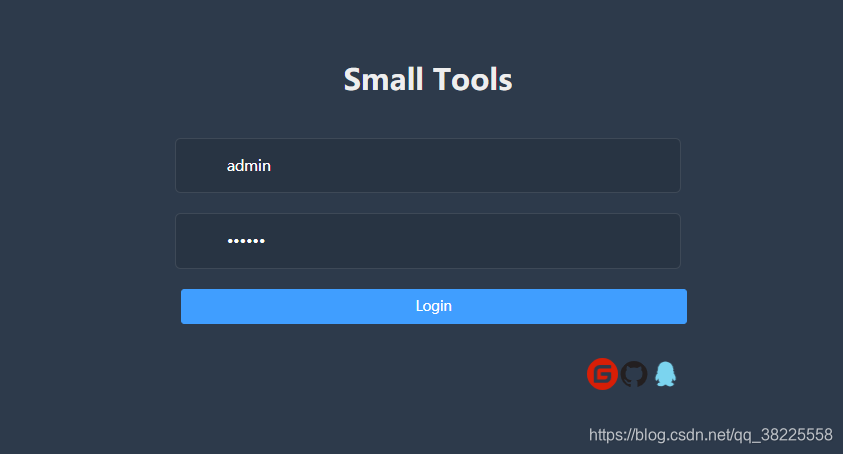
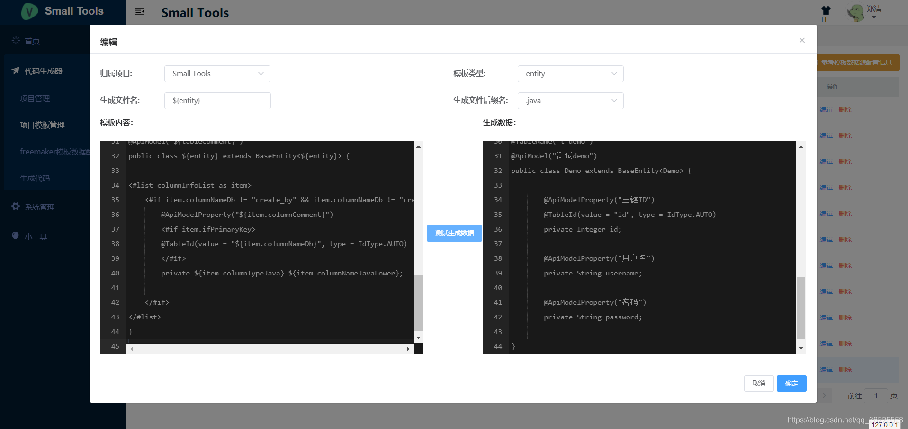
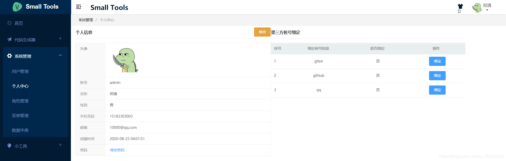
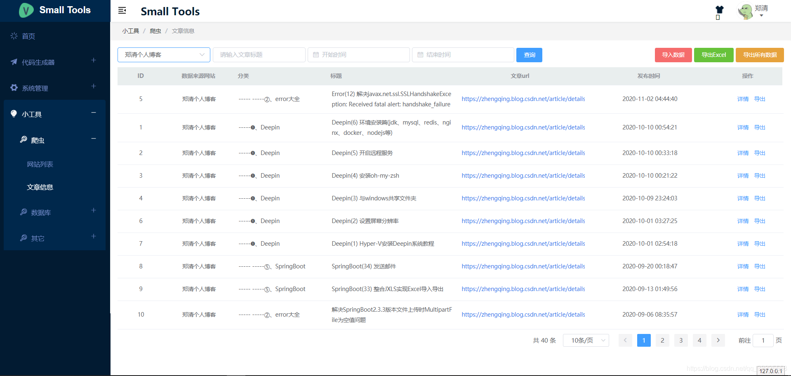
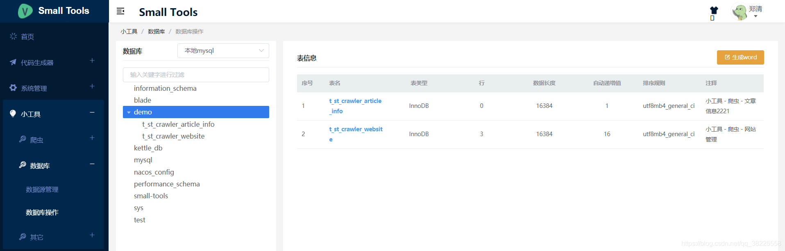

### 一、前言

> 项目地址：[https://gitee.com/zhengqingya/small-tools](https://gitee.com/zhengqingya/small-tools)

> SpringBoot版本 https://gitee.com/zhengqingya/smallboot

`Small-Tools`微服务项目

后端技术栈：

1. SpringBoot2.7.0
2. Spring Cloud Alibaba2021.0.1.0
3. Nacos2.0.3
4. Redis6.0.8
5. MySQL5.7
6. RabbitMQ
7. Docker

前端技术栈：

1. Vue3
2. Vite2
3. TypeScript
4. Vue Router
5. Element Plus
6. Pinia

目前功能点：

> 基本上都是常见的，这里不多说...

1. 系统管理
2. 代码生成器
3. 爬虫
4. 数据库管理
5. 三方登录
6. ...

### 二、运行

- 前端项目说明&运行见 [`small-tools-web/README.md`](small-tools-web/README.md)
- 后端项目说明&运行见 [`small-tools-api/README.md`](small-tools-api/README.md)

### 三、部分页面截图

### 四、其它

项目相关文档更新地址：[https://zhengqing.blog.csdn.net/category_10749058.html](https://zhengqing.blog.csdn.net/category_10749058.html)

---

> 分享语句：
> 每天提醒自己不要忘记梦想，
> 但不要麻木，
> 要很新鲜很激情，
> 保持梦想的热度。
