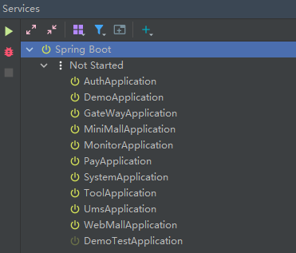

# 说明

### 服务

| 名称                | 描述      | 端口  |
| ------------------- | --------- | ----- |
| GateWayApplication  | 网关      | 1218  |
| AuthApplication     | 授权      | 1219  |
| SystemApplication   | 系统      | 20010 |
| MonitorApplication  | 监控      | 30000 |
| ToolApplication     | 小工具    | 20030 |
| UmsApplication      | C 端用户  | 10010 |
| MiniMallApplication | 商城-mini | 10020 |
| WebMallApplication  | 商城-web  | 10021 |
| PayApplication      | 支付      | 20050 |
| DemoApplication     | demo      | 20040 |

## 组件部署

> mysql、redis、nacos、rabbitmq、seata、sentinel、xxl-job、canal、elk等

见 [`doc/环境部署`](doc/环境部署)

## 本地运行

> 必须启动的服务：
> - GateWayApplication
> - AuthApplication
> - SystemApplication

> 其它服务可根据实际情况选择是否使用



## 项目部署

> tips: 暂存，不用看这个...

```shell
# 服务器运行
docker run -d -e APP_PROFILE=prod -p 1218:1218 -p 20010:20010 -p 20030:20030 --restart=always --name small-tools-api registry.cn-hangzhou.aliyuncs.com/zhengqing/small-tools-api:prod

# 查看容器运行内存信息  【参数`mem_limit: 1000m` # 最大使用内存】
docker stats small-tools-api
# CONTAINER ID        NAME                CPU %               MEM USAGE / LIMIT     MEM %               NET I/O             BLOCK I/O           PIDS
# df0f8f22629c        small-tools-api     398.44%             1.022GiB / 18.66GiB   5.47%               79kB / 40.5kB       0B / 0B             234
```

---

## 其它

### 数据库增加区分字段

> 为每张表（所有需要区分租户的表）增加一个 tenant_id 字段，用来区分租户

```shell
SELECT
	concat( 'ALTER TABLE ', table_schema, '.', table_name, ' ADD COLUMN tenant_id varchar(30) NULL;' ) 
FROM
	information_schema.TABLES t
WHERE
	table_schema = '指定数据库';
```

### 数据清理

```sql
SELECT CONCAT('DELETE FROM ', TABLE_NAME, ' where is_deleted=1;')
FROM information_schema.TABLES
WHERE table_schema = 'small-tools';
```

### error

###### Caused by: java.lang.IllegalStateException: No fallback instance of type class com.zhengqing.system.feign.fallback.IDictClientFallback found for feign client system

需要扫描feign包以及它的回调包fallback

```
@ComponentScan(basePackages = {"com.zhengqing.system", "com.zhengqing.common", "com.zhengqing.basic"})
```

### 打包问题

> 子模块如果不想打包则如下配置：

```
<build>
    <plugins>
        <plugin>
        <groupId>org.springframework.boot</groupId>
        <artifactId>spring-boot-maven-plugin</artifactId>
        <configuration>
          <!-- 跳过父模块的此打包插件 -->
          <skip>true</skip>
          <finalName>${project.name}</finalName>
        </configuration>
        </plugin>
    </plugins>
</build>
```
