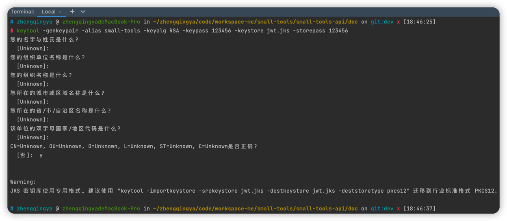

### 认证解决方案

`SpringSecurity + Oauth2 + JWT + Redis`

用户登录 -> 访问网关 -> 用户认证微服务 -> 合法则返回JWT -> 存储JWT到redis
用户请求服务 -> 访问网关 -> 网关认证JWT(redis) -> 校验令牌成功并储存携带用户信息跳转微服务 -> 微服务

### JWT令牌

```shell
# 1. 生成密钥证书 jwt.jks
# Keytool 是一个java提供的证书管理工具
#    -alias：密钥的别名 
#    -keyalg：密钥算法 
#    -keypass：密钥的访问密码 
#    -keystore：生成密钥库的存储路径和名称
#    -storepass：密钥库的访问密码
keytool -genkeypair -alias small-tools -keyalg RSA -keypass 123456 -keystore jwt.jks -storepass 123456

# 2. 查询证书
keytool -list -keystore jwt.jks

# 3. 获取jks文件的公钥
# 下载安装OpenSSL http://slproweb.com/products/Win32OpenSSL.html
# 配置环境变量
# 新建系统环境变量
OPENSSL_HOME -> D:\zhengqingya\soft\soft-dev\OpenSSL-Win64\bin
# 编辑PATH环境变量，新增
%OPENSSL_HOME%
# 验证安装
openssl version
# 进入jwt.jks所在目录执行 获取jks文件的公钥
keytool -list -rfc --keystore jwt.jks | openssl x509 -inform pem -pubkey
```


